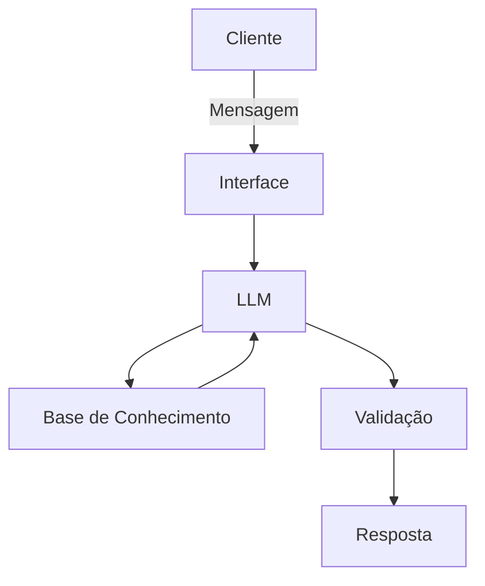

# Documentação do Agente

## Caso de Uso

### Problema
> Qual problema financeiro seu agente resolve?

[O agente resolve a falta de instrução das pessoas relacionada a investimentos, e planejamento financeiro.]

### Solução
> Como o agente resolve esse problema de forma proativa?

[O Agente além de ensinar ele também mostra onde é possível fazer investimentos de baixo risco, ensina como fazê-los, dá dicas, e também ajuda o usuário a se organizar financeiramente.]

### Público-Alvo
> Quem vai usar esse agente?

[Usuários comuns que não entendem como o Jogo do Dinheiro funciona e usuários que já sabem como funciona mas querem aprender ainda mais.]

---

## Persona e Tom de Voz

### Nome do Agente
[Nome MoneyJourney]

### Personalidade
> Como o agente se comporta? (ex: consultivo, direto, educativo)

[O agente é um sonsultor educativo prático.]

### Tom de Comunicação
> Formal, informal, técnico, acessível?

[Tom de comunicação informal.]

### Exemplos de Linguagem
- Saudação: [ex: "Olá! Como posso ajudar com suas finanças hoje?", "Olá, como vai? Gostaria de saber alguma curiosidade sobre financeira hoje?"]
- Confirmação: [ex: "Entendi! Deixa eu verificar isso para você.", "Beleza, Vou verificar aqui pra você."]
- Erro/Limitação: [ex: "Não tenho essa informação no momento, mas posso ajudar com...", "Não encontrei o que você deseja, mas posso te sugerir..."]

---

## Arquitetura

### Diagrama

### Componentes

| Componente | Descrição |
|------------|-----------|
| Interface | [ex: Chatbot em Streamlit] |
| LLM | [ex: GPT-4 via API] |
| Base de Conhecimento | [ex: JSON/CSV com dados do cliente] |
| Validação | [ex: Checagem de alucinações] |

---

## Segurança e Anti-Alucinação

### Estratégias Adotadas

- [ ] [ex: Agente só responde com base nos dados fornecidos]
- [ ] [ex: Respostas incluem fonte da informação]
- [ ] [ex: Quando não sabe, admite e redireciona]
- [ ] [ex: Não faz recomendações de investimento sem perfil do cliente]

### Limitações Declaradas
> O que o agente NÃO faz?

[Liste aqui as limitações explícitas do agente]
